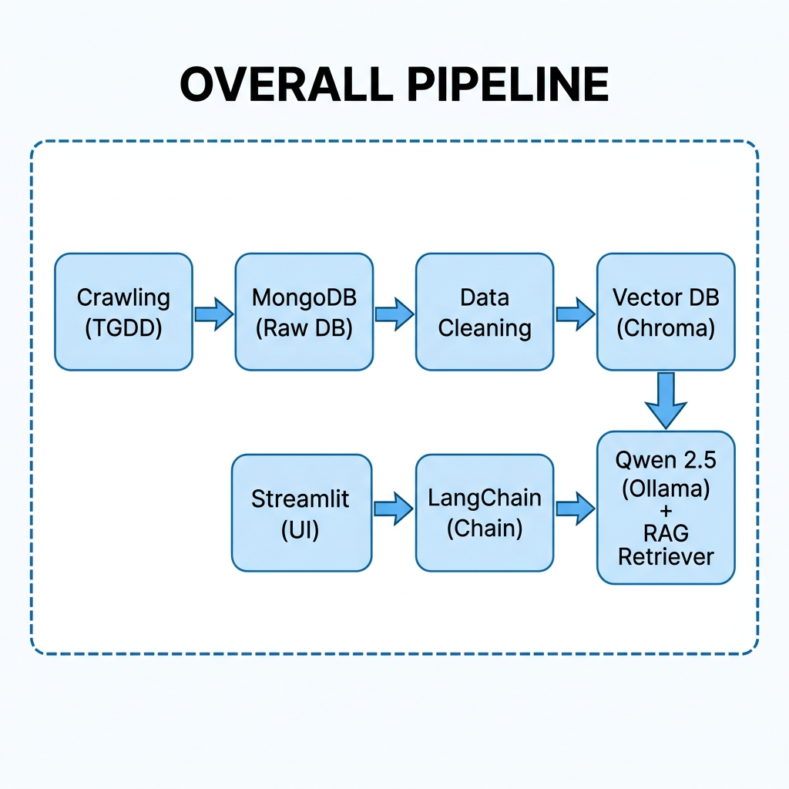

# 💻 Laptop Advisor Chatbot — RAG-based Laptop Recommendation for Vietnamese Students

<p align="center">
  
  
  
  
  
  
</p>

---

## 📖 Overview

**Laptop Advisor Chatbot** is an intelligent chatbot application built on the **RAG (Retrieval-Augmented Generation)** architecture to help Vietnamese students find the most suitable laptop for their needs and budget. The project is built **end-to-end from scratch**, covering the entire pipeline from **web crawling**, **data cleaning & processing**, **vector embedding** to **chatbot development** and **web deployment**.

### ✨ Key Features

- 🤖 **Context-aware Advice** — The chatbot understands conversation history and inherits previous requirements (budget, use case)
- 🔍 **Semantic Search** — Uses ChromaDB vector database to find the most relevant laptops based on query meaning
- 💰 **Up-to-date Pricing** — Data crawled directly from Thế Giới Di Động (Vietnam's largest electronics retailer) with **435+ laptop models**
- 📱 **Beautiful UI** — Deployed with Streamlit featuring dark theme, typing animation, and quick suggestion buttons
- 🇻🇳 **Vietnamese Language** — Chatbot responds entirely in Vietnamese, tailored for Vietnamese students

---

## 🏗️ System Architecture

<p align="center">
  
</p>

---

## 🗂️ Project Structure

```
langchain_learn/
│
├── crawling_data.py          # 🕷️ Crawl laptop data from Thế Giới Di Động
├── crawling_detail_page.py   # 🔍 Test script for crawling product detail pages
├── clean_product.ipynb       # 🧹 Data cleaning & preprocessing notebook
├── tgdd_Laptop_product.csv   # 📊 Crawled laptop dataset (CSV backup)
├── vector_database.py        # 📦 Vectorize data & store in ChromaDB
├── ingest.ipynb              # 📓 Experimental ingestion pipeline notebook
├── chat_bot.py               # 🤖 RAG chatbot logic (CLI version)
├── giao_dien.py              # 🎨 Streamlit web interface (Web UI)
├── vectorstore/              # 💾 Persisted ChromaDB vector database
│   └── chroma.sqlite3
└── README.md                 # 📖 Project documentation
```

---

## 🔧 Tech Stack

| Component | Technology | Description |
|---|---|---|
| **Web Crawling** | `Playwright` + `BeautifulSoup4` | Crawl laptop data from thegioididong.com |
| **Database** | `MongoDB` | Store raw and cleaned product data |
| **Data Cleaning** | `Pandas` + `Regex` | Process, normalize, and clean raw data |
| **Embedding** | `mxbai-embed-large` (Ollama) | Convert text into vector embeddings |
| **Vector Database** | `ChromaDB` | Store and perform similarity search on vectors |
| **LLM** | `Qwen 2.5:3b` (Ollama) | Language model for generating responses |
| **Framework** | `LangChain` | Orchestration framework for RAG pipeline |
| **UI / Deployment** | `Streamlit` | Web-based chatbot interface |

---

## 📋 Pipeline Details

### 1️⃣ Data Crawling (`crawling_data.py`)

Uses **Playwright** (headless browser) combined with **BeautifulSoup** to crawl data from [Thế Giới Di Động](https://www.thegioididong.com):

- **Brands crawled:** ASUS, Dell, HP, Lenovo, Acer, MSI, Gigabyte
- **Total products:** ~442 laptops
- **Data fields collected:**
  - Product name, price, image URL, product link
  - CPU, GPU, RAM (capacity + type + max upgrade)
  - Storage, display (size, resolution, panel type, refresh rate, color gamut)
  - Ports, webcam, battery, dimensions, material, release year

- **Crawling strategy:**
  - Auto-scroll and click "Load more" button to fetch all products
  - Random delay (1–4s) between requests to avoid being blocked
  - Crawl both the listing page and each product's detail page
  - Save directly to MongoDB collection `laptops`

### 2️⃣ Data Cleaning (`clean_product.ipynb`)

Processes raw data from MongoDB, including:

- Remove products with missing names (`name_product is null`)
- Normalize prices (convert from text `"14.390.000₫"` → numeric `14390000`)
- Parse and clean GPU info (card type, card name, VRAM capacity)
- Normalize RAM (extract GB value from text `"16 GB"` → `16`)
- Process display size, refresh rate, and release year
- Extract weight from `physical_dimensions` field
- Save cleaned data to MongoDB collection `laptop_cleaned`

### 3️⃣ Data Vectorization (`vector_database.py`)

Converts laptop information into **LangChain Documents** with the following structure:

- **`page_content`** — Natural language description in Vietnamese:
  ```
  Laptop Asus Vivobook 15 thương hiệu ASUS. Giá bán: 14.39 triệu VNĐ.
  Cấu hình gồm: Chip xử lí Intel Core i5, RAM 16GB DDR5, card đồ họa NVIDIA RTX 3050...
  Màn hình: 15.6 inch, Full HD, IPS, 60Hz...
  ```
- **`metadata`** — Structured fields: `id`, `brand`, `price_num`, `ram_gb`, `cpu`, `url`, `img`, `gpu_name`

**Embedding model:** `mxbai-embed-large` (runs locally via Ollama)  
**Vector store:** ChromaDB, persisted at `./vectorstore/`, top-k = 5

### 4️⃣ RAG Chatbot (`chat_bot.py`)

The chatbot uses a **2-chain architecture**:

```
User Input ──▶ [Chain 1: Recap] ──▶ Full Query ──▶ [Retriever] ──▶ RAG Context
                                                                        │
                                                                        ▼
              Response ◀── [Chain 2: Answer] ◀── Full Query + RAG Context + History
```

- **Chain 1 — Recap Chain:** Summarizes the user's request based on conversation history → generates a comprehensive query for the retriever
- **Chain 2 — Answer Chain:** Generates a recommendation response based on retrieved laptops + chat history

**Chatbot rules:**
1. Only recommend laptops from the available dataset
2. Always provide price and specifications
3. Inherit previous requirements (budget, use case)
4. Never contradict earlier requirements
5. If no match found → ask follow-up questions (max 3)

### 5️⃣ Web Deployment (`giao_dien.py`)

The web interface is built with **Streamlit**, featuring:

- 🌙 **Modern dark theme** with Be Vietnam Pro font
- 💬 **Chat UI** with custom styling for user/assistant messages
- ⏳ **Typing indicator** animation while the bot is processing
- 🏷️ **Quick suggestion buttons** (4 options) for new users:
  - 💰 Laptops under 15 million VND for students
  - 🎮 Gaming laptops with discrete RTX GPU
  - 🪶 Lightweight laptops under 1.5kg
  - 🎨 Laptops with great display for design work
- 🗑️ **Clear chat history** via sidebar button
- ⚡ **Resource caching** (`@st.cache_resource`) — model & vectorstore loaded only once

---

## 🚀 Installation & Setup

### Prerequisites

- **Python** >= 3.12
- **MongoDB** (running locally at `localhost:27017`)
- **Ollama** (for running LLM and embedding models locally)

### Step 1: Clone & Install Dependencies

```bash
git clone <repo-url>
cd langchain_learn

pip install langchain langchain-ollama langchain-community
pip install chromadb pymongo pandas
pip install playwright beautifulsoup4
pip install streamlit

# Install Playwright browser
playwright install chromium
```

### Step 2: Pull Ollama Models

```bash
# Install the LLM
ollama pull qwen2.5:3b

# Install the embedding model
ollama pull mxbai-embed-large
```

### Step 3: Crawl Data (Optional — if you need to refresh data)

```bash
# Make sure MongoDB is running
python crawling_data.py
```

### Step 4: Clean Data

Open and run `clean_product.ipynb` to process the raw crawled data.

### Step 5: Build Vector Database

```bash
python vector_database.py
```

### Step 6: Run the Chatbot

**Option A — CLI (Terminal):**
```bash
python chat_bot.py
```

**Option B — Web UI (Streamlit):**
```bash
streamlit run giao_dien.py
```

The app will open at `http://localhost:8501`.

---

## 📊 Dataset Summary

| Info | Details |
|---|---|
| **Data Source** | [Thế Giới Di Động](https://www.thegioididong.com) (Vietnam's largest electronics retailer) |
| **Total Products** | ~435 laptop models |
| **Brands** | ASUS, Dell, HP, Lenovo, Acer, MSI, Gigabyte |
| **Fields per Product** | 24 fields |
| **Database** | MongoDB — `LaptopDataDB` |
| **Collections** | `laptops` (raw), `laptop_cleaned` (cleaned) |

---

## 🛠️ Future Improvements

- [ ] Add pre-retrieval filters by price, brand, and use case
- [ ] Support side-by-side comparison of 2–3 laptops
- [ ] Display product images directly in the chat
- [ ] Include direct purchase links to Thế Giới Di Động
- [ ] Set up a cron job for automatic periodic data refresh
- [ ] Upgrade to a larger model (Qwen 7B / 14B) for better responses
- [ ] Deploy to cloud (Streamlit Cloud / HuggingFace Spaces)

---

## 👨‍💻 Author

**Việt sama Studio**

---

## 📜 License

This project is developed for educational and research purposes only.  
Data crawled from Thế Giới Di Động is used strictly for non-commercial purposes.
